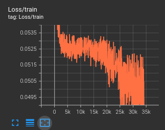
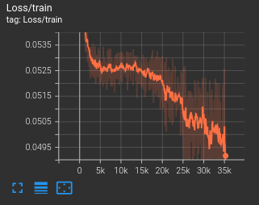
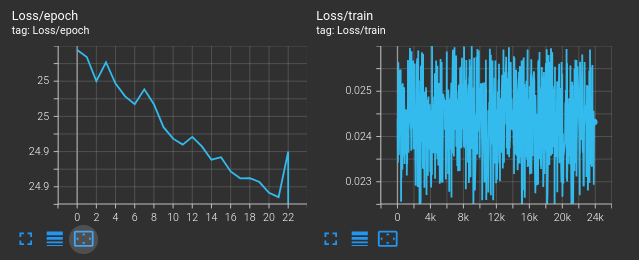

### Training Journal

## Audio Samples

| Training            | Original                                               | Reconstructed                                               |
| ------------------- | ------------------------------------------------------ | ----------------------------------------------------------- |
| First trainings     | <audio controls src="./assets/original_0.wav"></audio> | <audio controls src="./assets/reconstructed_0.wav"></audio> |
| 2025-11-29/03-27-25 | <audio controls src="./assets/original_1.wav"></audio> | <audio controls src="./assets/reconstructed_1.wav"></audio> |

#### Training loss does not decrease

Solutions:

- increase model capacity to max that can be fitted in VRAM (we set batch size 1, and use gradient accumulation).
- increase number of grad accum steps.
- lr tuning (warmup, cosine decrease).

#### High variance loss later in the training:

We remark that the variance of the loss increases with the decrease of its mean

Cause: as training progresses the true loss L shrinks but stochastic noise from mini‑batches, label noise, augmentations and numerical errors does not shrink at the same rate. So the relative spread compared to L grows as L decreases (signal‑to‑noise ratio falls).

Quick solutions we consider :

- increase number of gradient accumulation steps to reduce sampling noise.
- (Smooth reported loss with an exponential moving average (EMA) or running median.)
- Reduce learning rate or use a finer LR schedule near convergence.
- (Use adaptive optimizers (AdamW) and gradient clipping to stabilize updates.)

since the dataset is small at this point (1024 sample), we also consider some kind of generalization or overfitting issue (to be explored later).

#### 29/11/2025

- Batch-level loss appears flat and noisy because it is logged before optimizer updates and after being divided by the gradient accumulation factor.
  → This compresses the values into a narrow range (≈0.023–0.027) and makes natural batch-to-batch variance appear chaotic.

- Epoch-level loss decreases smoothly, which shows that the model is learning correctly.
  → This is the true metric to track for training progress.

- Autoregressive RVQ/EnCodec training naturally produces high variance in per-batch loss, due to multi-quantizer cross-entropy and sequence-level token prediction.

- Conclusion: The noisy batch-loss plot is expected and not a sign of instability; the decreasing epoch loss confirms stable training.

#### 30/11 Simplify the problem

- Move text tokenization to char level, Only uppercase
